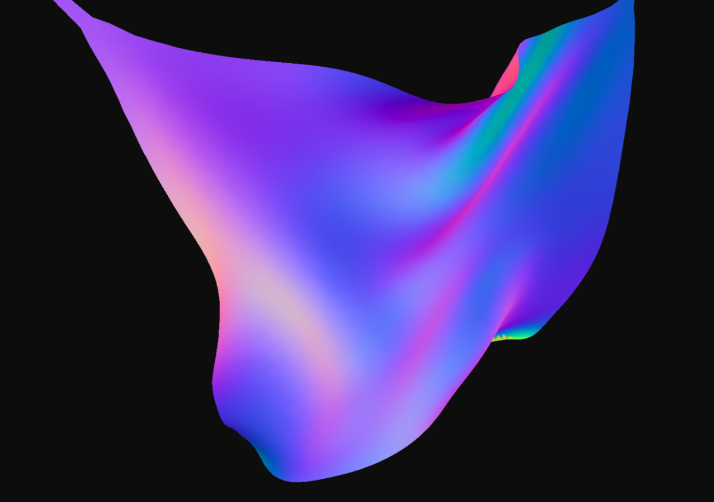

# Cloth & Paper Simulation

A Position-Based Dynamics (PBD) cloth and paper simulation implemented in Rust. Supports both WebAssembly (browser with WebGPU rendering) and native headless execution for debugging/benchmarking.



## Building

### WASM (Browser)

Compile the WASM package and run the development server:

```bash
cd rust && wasm-pack build --target web
cd .. && npm install && npm run dev
```

### Native (Headless)

Build the native CLI for headless simulation:

```bash
cd rust
cargo build --release --features native
```

The binary will be at `target/release/native`.

## Native CLI Usage

```
native <command> [options]

Commands:
  cloth [options]              Run cloth simulation
  paper <cp_file> [options]    Run paper simulation with crease pattern
  dump-settings [file]         Dump default settings to JSON file (or stdout)

Options:
  --steps <n>        Number of simulation steps (default: 1000)
  --resolution <n>   Grid resolution for cloth (default: 32)
  --settings <file>  Load simulation parameters from JSON file
```

### Examples

Run a basic cloth simulation:
```bash
./target/release/native cloth --steps 500 --resolution 32
```

Dump default settings to a file, modify, and use:
```bash
./target/release/native dump-settings params.json
# Edit params.json as needed
./target/release/native cloth --settings params.json --steps 1000
```

Run paper simulation with a crease pattern:
```bash
./target/release/native paper patterns/crane.cp --steps 2000
```

## Settings File

The settings JSON file contains all simulation parameters exposed to JavaScript in the browser version. Generate a default file with `dump-settings`:

```json
{
  "time_step": 0.01,
  "constraint_iters": 5,
  "gravity_enabled": true,
  "gravity_g": -9.8,
  "pin_enabled": true,
  "pin_weight": 1.0,
  "stretch_enabled": true,
  "stretch_weight": 0.5,
  "bending_enabled": true,
  "bending_weight": 0.5,
  "pulling_enabled": true,
  "pulling_weight": 0.1,
  "pulling_area": 5,
  "self_collision_enabled": true,
  "self_collision_threshold": 0.02,
  "self_collision_recompute_iters": 1,
  "use_distance_constraints": false,
  "damping": 0.0
}
```

### Parameter Reference

| Parameter | Type | Default | Description |
|-----------|------|---------|-------------|
| `time_step` | f64 | 0.01 | Simulation time step (seconds) |
| `constraint_iters` | u32 | 5 | PBD constraint solver iterations per step |
| `gravity_enabled` | bool | true | Enable gravity |
| `gravity_g` | f64 | -9.8 | Gravity acceleration (m/s²) |
| `pin_enabled` | bool | true | Enable pinned vertices |
| `pin_weight` | f64 | 1.0 | Pin constraint weight |
| `stretch_enabled` | bool | true | Enable stretch constraints |
| `stretch_weight` | f64 | 0.5 | Stretch constraint weight |
| `bending_enabled` | bool | true | Enable bending constraints |
| `bending_weight` | f64 | 0.5 | Bending constraint weight |
| `pulling_enabled` | bool | true | Enable mouse/touch pulling |
| `pulling_weight` | f64 | 0.1 | Pull constraint weight |
| `pulling_area` | u32 | 5 | Radius of vertices affected by pull |
| `self_collision_enabled` | bool | true | Enable self-collision detection |
| `self_collision_threshold` | f64 | 0.02 | Collision distance threshold |
| `self_collision_recompute_iters` | u16 | 1 | BVH recompute frequency |
| `use_distance_constraints` | bool | false | Use fast distance constraints vs shape matching |
| `damping` | f64 | 0.0 | Velocity damping (0.0 = none, 0.05 = 5% per step) |

## Architecture

```
rust/src/
├── lib.rs              # Core library exports
├── params.rs           # SimParams struct
├── platform.rs         # Platform abstraction traits
├── platform_context.rs # Thread-local platform services
├── sim/                # Core simulation (platform-independent)
│   ├── cloth_sim.rs
│   ├── paper_sim.rs
│   ├── rigid_sim.rs
│   └── shared.rs
├── arch/
│   ├── mod.rs          # cfg-guarded module selection
│   ├── wasm/           # WebAssembly + WebGPU rendering
│   │   ├── harness.rs  # wasm_bindgen entry points
│   │   ├── gpu.rs
│   │   ├── cloth.rs
│   │   └── ...
│   └── native/         # Native headless execution
│       ├── harness.rs  # CLI harness
│       └── platform.rs
└── bin/
    └── native.rs       # Native binary entry point
```

The architecture isolates platform-specific code in `arch/`. All `#[cfg]` attributes are contained in `arch/mod.rs` - core simulation code has no conditional compilation.


### Extra Credit (CES)
I Jeffery Xu, on my honor, have completed the CES evaluation for this class
I Clint Wang, on my honor, have completed the CES evaluation for this class
